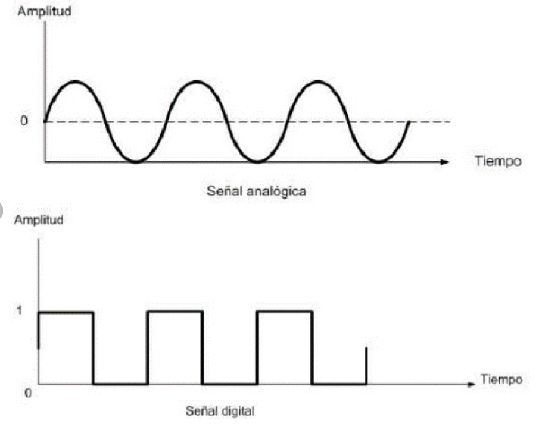
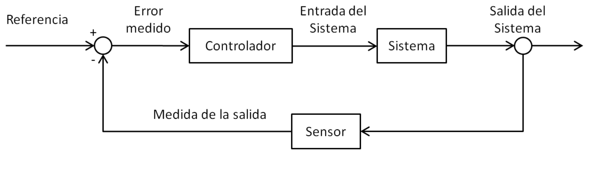

# Introducción Control Digital

En la primera clase de control se explica lo que son las señales analógicas y digitales, haciendo una breve introducción a cursos anteriores como lo son mostrar estructuras de controladores analógicos y digitales dando un ejemplo.

se explica también sobre la conversión analógica a digital y digital a análoga, con sus modelos de conversión, y por último se explica lo que son las resistencias ponderadas y red escalera R-2R.

## 1. Señales digitales vs analógicas

Se presentan 2 señales las cuales una de ellas es de tipo analógico y otra de tipo digital. de la señal analógica se habla de los diferentes tipos de valores que estas pueden llegar a tener y como va variando con respecto al tiempo, en contraste a esto se presenta una señal digital la cual solo obtiene 2 posibles valores los cuales son '1' y '0' y su forma de onda es cuadrada.

se presenta una pregunta la cual expresa el por qué es mejor control digital, el control digital es mejor porque en términos de precisión es mejor ya que nos permite un control más exacto con respecto a las condiciones que se desean, también nos permiten minimizar errores al momento de implementarlos por temas de diseños y en los cuales en los sistemas analógicos pueden ser más difíciles de controlar, nos permite más flexibilidad al momento de modificar o actualizar, y en términos de costos son más baratos y con una mayor velocidad con respecto al avance de la tecnología.

## 2. Estructura controlador:

### 2.1.Estructura del controlador analógico:

de primeras se nos presenta la imagen de un controlador analógico, este controlador toma la señal del sensor y la compara con una resta (set point), se resta con respecto a la salida de la planta para saber cuanto es menor el error, este representa un lazo de control retroalimentado 

### 2.2.Estructura del controlador digital:

en el controlador digital este recibe como entrada una señal analogica, nos muestra como funciona un ciclo de retroalimentacion para controlar un proceso de conversion de señales de forma analogica a digital. 

### 2.3.Ejemplo:

Como ejemplo podemos escoger el siguiente controlador retroalimentado, mas concretamente un sistema de control de nivel de agua en un tanque, en este caso el tanque de agua tiene 2 niveles, uno nivel mínimo y otro nivel máximo (set-point), hay dos sensores dentro del tanque que detectan estos niveles, luego encontramos El comparador este es un dispositivo de control que recibe señales de los dos sensores de nivel, Compara estas señales con los niveles para determinar si se necesita más agua o si debe detenerse el llenado.

El actuador es una bomba de agua que se enciende o apaga según las señales, Cuando el nivel del agua está por debajo del nivel mínimo, la bomba se activa y Cuando el agua alcanza el nivel máximo, la bomba se apaga.

La variable que podemos controlar es el flujo de agua, el sistema controla esta variable con respecto a su retroalimentación.

>🔑La realimentación, ​​ retroalimentación, ​​ o retroacción, ​ es un mecanismo por el cual una cierta proporción de la salida de un sistema se redirige a la entrada, con señales de controlar su comportamiento

## 3. Conversión Análoga a Digital:

Uno de los procesos que se usa para este tipo de convertidor es el muestreo el cual consiste en medir voltaje en cada cierto tiempo, Una frecuencia de muestreo rápida implica tener más puntos en un tiempo dado y por ende formar una mejor representación de la señal medida, Una tasa de muestreo baja hace que se pierda la información de la señal.
luego de que la señal se a muestreado la señal análoga da una serie de valores los que corresponden a una de las medidas tomadas, la cuantización toma estos valores muestreados en valores discretos para que puedan ser representados de forma digital.

## 4. Conversión Digital a Análoga:

se excplica sobre un convertidor digital a analógico, este es un dispositivo que convierte señales digitales en señales analógicas. Es esencial en sistemas donde la información digital procesada por computadoras o controladores.

para la resolucion del analogo dijital depende de los bits de representacion, los cuales se representan de la siguiente manera teniendo como referencia el fondo de escala de 15v:

| Bits (entrada)  |  Resolucion (v)  | Resolucion(%FS)  |
|---|---|---|
| 4  |  1 | 6,6  |
|  8 | 0.059  | 0.04  |
|  16 | 229𝑥10−6  | 0,0015  |
|  32 | 3,5𝑥10−9  |  0,00000000023 |

### 4.1.Metodos de convercion:
en metodos se encuentran 2 metodos los cuales son resistencias ponderadas y red R-2R.

#### 4.1.1.Resistencias Ponderadas:

Un conversor o convertidor digital analógico (DAC) por suma ponderada suma varias señales digitales binarias de acuerdo al peso de cada una dando como resultado una señal de corriente o tensión analógica.

#### 4.1.1.Conversor digital analogico R-2R:

Un conversor o convertidor digital analógico (DAC) R-2R suma varias señales digitales binarias de acuerdo al peso de cada una dando como resultado una señal de corriente o tensión analógica.

## 5. Zero order Hold (ZOH):

El Zero-Order Hold o "retenedor de orden cero", es un método utilizado en sistemas de control digital para convertir una señal digital en una señal analógica continua.

este toma valores de una señal digital a intervalos regulares y los mantiene constantes hasta la siguiente muestra. la cual crea una señal escalonada que aproxima la señal analógica original.

estas se usan comúnmente en la implementación de controladores digitales y en la reconstrucción de señales analógicas en sistemas de control en tiempo real, estos tambien los puedes encontrar de orden superior como first order hold y second order hold.

## 6. Conclusiones

- El muestreo es esencial en la conversión de señales análogas a digitales, ya que mide el voltaje en intervalos de tiempo específicos.
- Una frecuencia de muestreo alta mejora la precisión de la señal digitalizada, mientras que una baja puede resultar en pérdida de información.
- entre Zero-Order Hold, es mas facil de implementar y requiere menos procesamiento y memoria.

## 7. Referencias(Imagenes):

-https://es.wikipedia.org/wiki/Teor%C3%ADa_del_control

-https://www.researchgate.net/figure/Senal-analogica-y-Senal-digital_fig1_362489895

-https://www.monografias.com/trabajos101/introduccion-control-digital/introduccion-control-digital

-https://www.ingmecafenix.com/automatizacion/control/sistema-de-control/

-https://wilaebaelectronica.blogspot.com/2017/01/conversor-digital-analogico-por-suma-ponderada.html

-https://wilaebaelectronica.blogspot.com/2017/01/conversor-digital-analogico-r-2r.html

