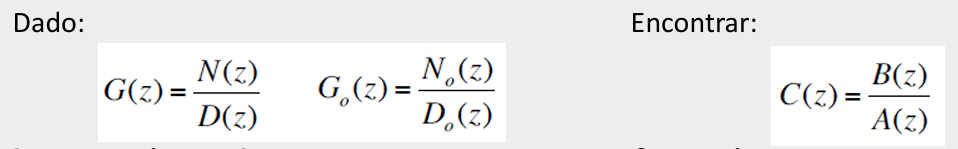
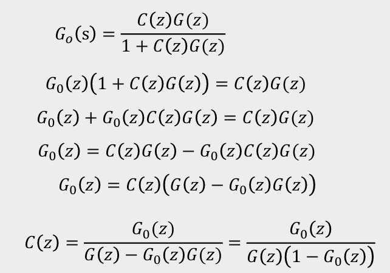
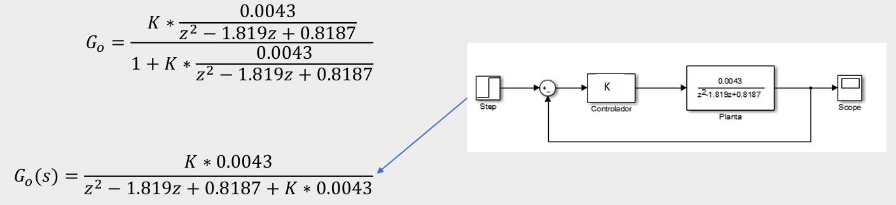
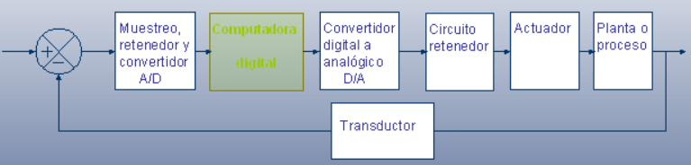
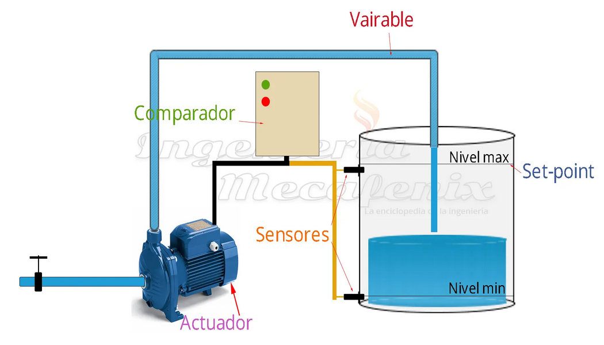
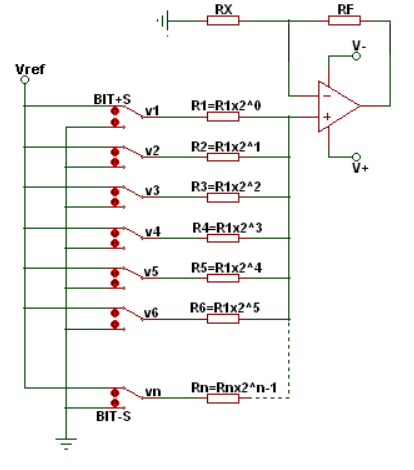
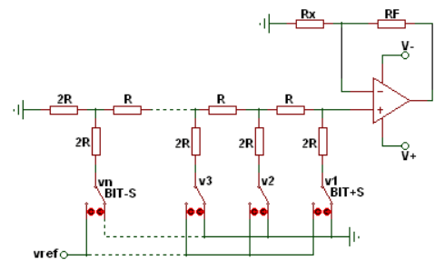

# Metodos algebraicos

-Estos métodos utilizan herramientas algebraicas para ajustar y controlar el comportamiento del sistema en lazo cerrado, logrando la respuesta deseada en el sistema.

-El principio clave de estos métodos es modificar la función de transferencia en lazo cerrado para que el sistema alcance una respuesta específica, alineada con el comportamiento deseado.

-Existen dos enfoques principales para aplicar estos métodos: uno basado en la igualación de modelo y otro en la igualación de coeficientes. Ambos enfoques buscan optimizar el rendimiento del sistema en función de parámetros específicos.

Cuando se tiene un sistema de ecuaciones (es decir 2 o más ecuaciones), se
pueden utilizar estos métodos.

Los 3 métodos algebraicos son:

- Igualación
- Sustitución
- Sumas y Restas

## 1. Igualación de modelo por métodos algebráicos

La igualación de modelo por métodos algebraicos es una técnica que consiste en modificar la función de transferencia de un sistema en lazo cerrado para que coincida con la función de transferencia de un modelo de referencia deseado. Esto se logra ajustando los parámetros del controlador para que el sistema real tenga un comportamiento similar al modelo objetivo.

se presento el sigiente ejemplo por igualacion de modelos:

## 2. Igualación de coeficientes:

Luego se nos explica la igualación de coeficientes que consta de un método algebraico utilizado en el diseño de controladores. Su objetivo es ajustar los parámetros del sistema de control (por ejemplo, ganancias de un controlador) de manera que la función de transferencia en lazo abierto del sistema tenga la forma deseada, coincidiendo los coeficientes de las expresiones polinómicas en el numerador y el denominador.

se explica uno de los ejemplos con respecto a la igualacion de coeficientes:

En algunos casos no se puede solucionar por acción proporcional, entonces toca usar otro método como lo son las funciones causales, en estas toca tener un par de consideraciones, entre las cuales encontramos que las funciones de planta y de controlador deben ser propias otra es que La igualación se realiza en el polinomio característico por lo tanto no hay control sobre la ubicación de los ceros del sistema.
Una vez realizado este procedimiento el polinomio debe tener el mismo numero de incógnitas como de términos. 

### 2.2.Estructura del controlador digital:

en el controlador digital este recibe como entrada una señal analogica, nos muestra como funciona un ciclo de retroalimentacion para controlar un proceso de conversion de señales de forma analogica a digital. 

### 2.3.Ejemplo:

Como ejemplo podemos escoger el siguiente controlador retroalimentado, mas concretamente un sistema de control de nivel de agua en un tanque, en este caso el tanque de agua tiene 2 niveles, uno nivel mínimo y otro nivel máximo (set-point), hay dos sensores dentro del tanque que detectan estos niveles, luego encontramos El comparador este es un dispositivo de control que recibe señales de los dos sensores de nivel, Compara estas señales con los niveles para determinar si se necesita más agua o si debe detenerse el llenado.

El actuador es una bomba de agua que se enciende o apaga según las señales, Cuando el nivel del agua está por debajo del nivel mínimo, la bomba se activa y Cuando el agua alcanza el nivel máximo, la bomba se apaga.

La variable que podemos controlar es el flujo de agua, el sistema controla esta variable con respecto a su retroalimentación.

>🔑La realimentación, ​​ retroalimentación, ​​ o retroacción, ​ es un mecanismo por el cual una cierta proporción de la salida de un sistema se redirige a la entrada, con señales de controlar su comportamiento

## 3. Conversión Análoga a Digital:

Uno de los procesos que se usa para este tipo de convertidor es el muestreo el cual consiste en medir voltaje en cada cierto tiempo, Una frecuencia de muestreo rápida implica tener más puntos en un tiempo dado y por ende formar una mejor representación de la señal medida, Una tasa de muestreo baja hace que se pierda la información de la señal.
luego de que la señal se a muestreado la señal análoga da una serie de valores los que corresponden a una de las medidas tomadas, la cuantización toma estos valores muestreados en valores discretos para que puedan ser representados de forma digital.

## 4. Conversión Digital a Análoga:

se excplica sobre un convertidor digital a analógico, este es un dispositivo que convierte señales digitales en señales analógicas. Es esencial en sistemas donde la información digital procesada por computadoras o controladores.

para la resolucion del analogo dijital depende de los bits de representacion, los cuales se representan de la siguiente manera teniendo como referencia el fondo de escala de 15v:

| Bits (entrada)  |  Resolucion (v)  | Resolucion(%FS)  |
|---|---|---|
| 4  |  1 | 6,6  |
|  8 | 0.059  | 0.04  |
|  16 | 229𝑥10−6  | 0,0015  |
|  32 | 3,5𝑥10−9  |  0,00000000023 |

### 4.1.Metodos de convercion:
en metodos se encuentran 2 metodos los cuales son resistencias ponderadas y red R-2R.

#### 4.1.1.Resistencias Ponderadas:

Un conversor o convertidor digital analógico (DAC) por suma ponderada suma varias señales digitales binarias de acuerdo al peso de cada una dando como resultado una señal de corriente o tensión analógica.

#### 4.1.1.Conversor digital analogico R-2R:

Un conversor o convertidor digital analógico (DAC) R-2R suma varias señales digitales binarias de acuerdo al peso de cada una dando como resultado una señal de corriente o tensión analógica.

## 5. Zero order Hold (ZOH):

El Zero-Order Hold o "retenedor de orden cero", es un método utilizado en sistemas de control digital para convertir una señal digital en una señal analógica continua.

este toma valores de una señal digital a intervalos regulares y los mantiene constantes hasta la siguiente muestra. la cual crea una señal escalonada que aproxima la señal analógica original.

estas se usan comúnmente en la implementación de controladores digitales y en la reconstrucción de señales analógicas en sistemas de control en tiempo real, estos tambien los puedes encontrar de orden superior como first order hold y second order hold.

## 6. Conclusiones

- El muestreo es esencial en la conversión de señales análogas a digitales, ya que mide el voltaje en intervalos de tiempo específicos.
- Una frecuencia de muestreo alta mejora la precisión de la señal digitalizada, mientras que una baja puede resultar en pérdida de información.
- entre Zero-Order Hold, es mas facil de implementar y requiere menos procesamiento y memoria.

## 7. Referencias(Imagenes):

-https://es.wikipedia.org/wiki/Teor%C3%ADa_del_control

-https://www.researchgate.net/figure/Senal-analogica-y-Senal-digital_fig1_362489895

-https://www.monografias.com/trabajos101/introduccion-control-digital/introduccion-control-digital

-https://www.ingmecafenix.com/automatizacion/control/sistema-de-control/

-https://wilaebaelectronica.blogspot.com/2017/01/conversor-digital-analogico-por-suma-ponderada.html

-https://wilaebaelectronica.blogspot.com/2017/01/conversor-digital-analogico-r-2r.html

