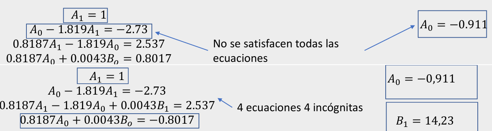

# Solucion del Parcial

-En la anterior clase se hizo la prueba del parcial, se da solucion al parcial de la sigiente manera:

## 1. Primer punto
(las sigientes ecuaciones se generan de forma manuel en la sigiente url https://latexeditor.lagrida.com/)

## 2. Igualación de coeficientes:

Luego se nos explica la igualación de coeficientes que consta de un método algebraico utilizado en el diseño de controladores. Su objetivo es ajustar los parámetros del sistema de control (por ejemplo, ganancias de un controlador) de manera que la función de transferencia en lazo abierto del sistema tenga la forma deseada, coincidiendo los coeficientes de las expresiones polinómicas en el numerador y el denominador.

se explica uno de los ejemplos con respecto a la igualacion de coeficientes:

En algunos casos no se puede solucionar por acción proporcional, entonces toca usar otro método como lo son las funciones causales, en estas toca tener un par de consideraciones, entre las cuales encontramos que las funciones de planta y de controlador deben ser propias otra es que La igualación se realiza en el polinomio característico por lo tanto no hay control sobre la ubicación de los ceros del sistema.
Una vez realizado este procedimiento el polinomio debe tener el mismo numero de incógnitas como de términos. 

## 6. Conclusiones

- El método de igualación de coeficientes nos permite diseñar controladores ajustando con precisión los coeficientes de las funciones de transferencia, esto nos permite garantizar que el sistema siga un comportamiento dinámico que se desea.
- En igualación de coeficientes en lazo abierto se puede aplicar tanto en sistemas continuos como discretos, proporcionando una herramienta flexible para el diseño de controladores.
  

